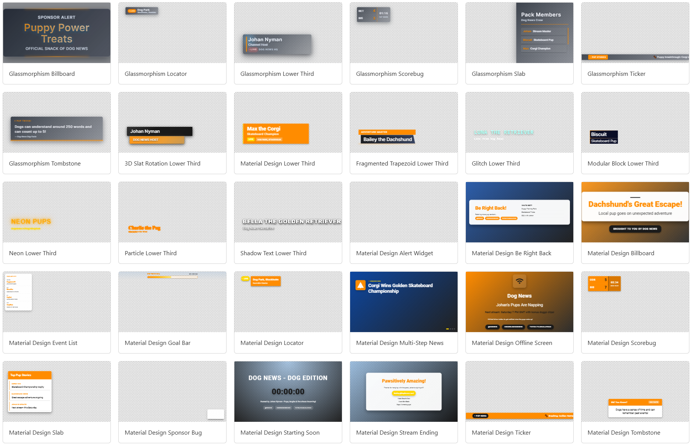

# Johan's OGraf graphics stash

This repository contains a collection of (mostly AI-generated) [OGraf](https://ograf.ebu.io) graphics. They are free to use for any purpose, but please note that they are provided "as is" without any warranty or guarantee of quality.

---

Tip: To view the graphics in this repository, you can use the [OGraf Devtool by SuperFly.tv](https://ograf-devtool.superfly.tv):

* [Download the graphics as a ZIP file](https://download-directory.github.io/?url=https%3A%2F%2Fgithub.com%2Fnytamin%2Fograf-templates).
* Unzip the downloaded file to a local directory on your computer.
* Go to the [OGraf Devtool](https://ograf-devtool.superfly.tv) and pick your local directory to load the graphics.

## Contributions

If you'd like to contribute to this repository, please feel free to submit a Pull Request with your additions or improvements. All contributions are welcome, whether it's additions of new graphics or improvements/fixes to existing ones.

## Contents

